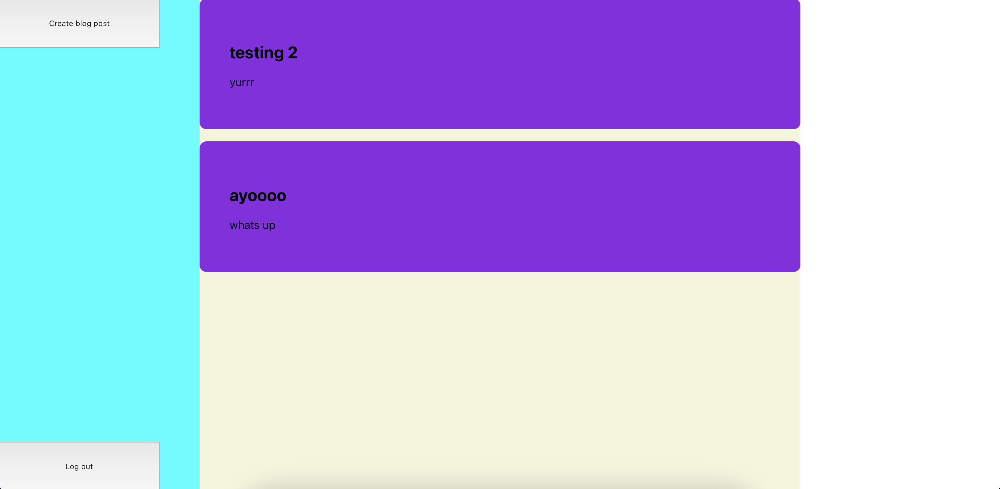
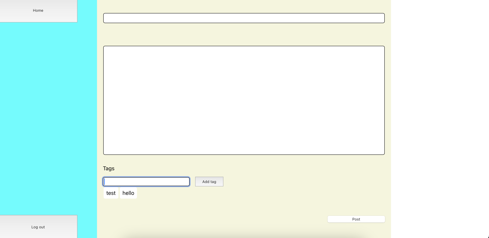

# CMS

An example Content Management System using Firebase



<details>
<summary>Click for more screenshots</summary>
  



</details>

## Features

🚀 You can login

🚀 Sign up

🚀 Blog posts are laid out in a feed

🚀 Updating a blog post is easy

🚀 Supports cookies 🍪

## Pre-requisite

> [!IMPORTANT]
> You should have a Firebase Realtime Database already setup

Create a file called `const.js`. We will put our Firebase credentials here and reference it in the main file, `app.js`

```javascript
const apiKey = "" // input your credentials here
const authDomain = ""
const databaseURL = ""
const projectId = ""
const storageBucket = ""
const messagingSenderId = ""
const appId = ""

// this is the CommonJS way of doing things
// node js defaults to CommonJS
// CommonJS does not recognise "export" as a valid keyword
// if you want to use export as a valid keyword, 
// specify "type": "module" in package.json.
module.exports = { apiKey, authDomain, databaseURL, projectId, storageBucket, messagingSenderId, appId }
```

## How to install

1. Get the code
```
git clone https://github.com/muhdmirzamz/CMS.git
```

2. Go to the cms_backend folder and `npm install`
3. Go to the cms-frontend-example folder and `npm install`
4. Go to cms_backend folder and `node app.js`
5. Go to the cms-frontend-example folder and `npm start`

<details>
<summary>Click for things learned</summary>

## Things learned 🤓

💡 stretching a div to the entirety of a webpage

💡 how to adjust the size of the container according to size of content

💡 how to reduce the height of a text area by limiting the number of its rows

💡 how to increase the size of the caret in a text area

💡 how to make an unordered list go horizontal

💡 learned how to do cookies

💡 learned how to separate api keys for the backend

💡 learned how to do README formatting

</details>

<details>
<summary>Click for technologies used</summary>

## Technologies used 🤓

🔧 flexbox

🔧 firebase

🔧 axios

🔧 react router
  
</details>


